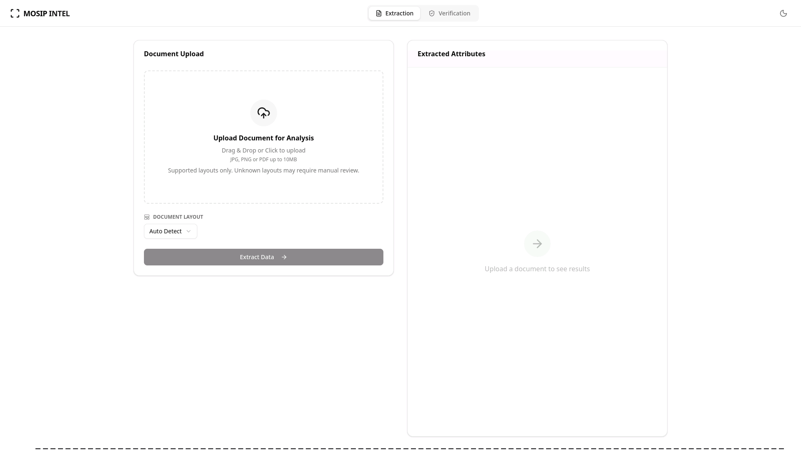
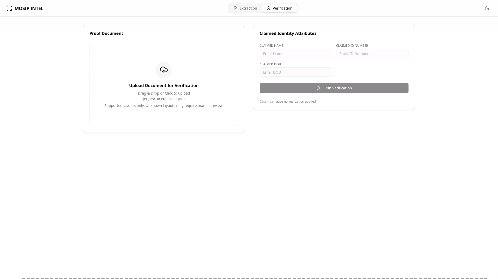
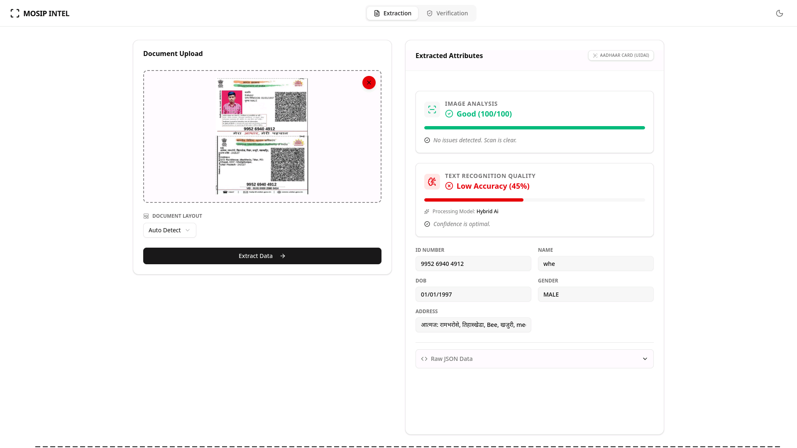
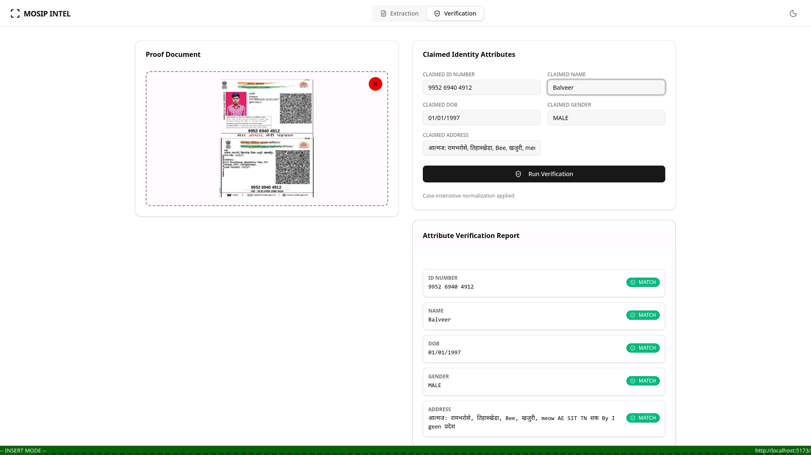

<p align="center">
  
  
  
  
  
</p>

# Hybrid OCR System – MOSIP Hackathon

A **hybrid OCR pipeline** built for the **MOSIP Hackathon**, designed to extract and verify identity data from scanned documents and images.
The system intelligently switches between **printed OCR** and **AI-based handwritten OCR**, with a modern frontend for review and verification.

---

## Project Information

- **Hybrid OCR approach** (Printed + Handwritten)
- Automatic **document type detection**
- Supports **images and PDFs**
- Designed for **identity documents** (ID cards, Aadhaar, PAN, passports, MOSIP Blue Card samples)
- Built with **Node.js backend** and **React + Vite frontend**

---

## Architecture Overview

Frontend (React + Vite)
↓
Backend (Express API)
↓
Hybrid OCR Engine
├── Tesseract.js (Printed Text)
└── TrOCR (Handwritten Text - ONNX)

---

## Installation & Setup

### Prerequisites

- Node.js (v18+ recommended)
- npm

---

### Backend Setup

```bash
cd Backend
npm install
npm run server
```

Backend runs the OCR engine, extraction logic, and verification routes.

---

### Frontend Setup

```bash

cd Frontend
npm install
npm run dev
```

Frontend runs on Vite and connects to the backend APIs.

---

# OCR Modes (Hybrid Logic)

The OCR engine automatically decides the best approach:

### Printed Text

- Uses **Tesseract.js**
- Keyword detection + confidence analysis
- Optimized for government-issued IDs

### Handwritten Text

- Uses **TrOCR (Xenova transformers)**
- ONNX models cached locally
- Activated when printed confidence is low or handwriting is detected

### Supported Inputs

- JPG / PNG / WEBP
- PDF (embedded text or scanned PDFs)

---

## UI Panels

### Extraction Panel

- Upload document
- View extracted fields
- Raw OCR output viewer
- OCR confidence & model used

### Verification Panel

- Field-level verification
- Confidence indicators
- Designed for manual review workflows

---

## Screenshots

| Extraction Panel                                       | Verification Panel                                         |
| ------------------------------------------------------ | ---------------------------------------------------------- |
|  |  |

| Extraction Test                                      | Verification Test                                        |
| ---------------------------------------------------- | -------------------------------------------------------- |
|  |  |

---

## Backend Highlights

- Automatic PDF to image conversion
- Image preprocessing (grayscale, safe transforms)
- Printed vs handwritten decision logic
- Strip-based OCR support for complex layouts
- Modular routes:
  - /extraction
  - /verification
  - /layouts

---

## Tech Stack

### Frontend

- React
- TypeScript
- Vite
- Tailwind / ShadCN UI

### Backend

- Node.js
- Express
- Tesseract.js
- TrOCR (Xenova Transformers)
- ONNX Runtime

---

### License

MIT License
